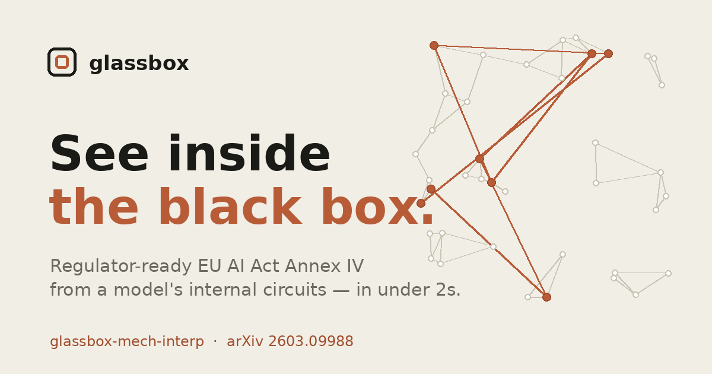

<div align="center">



# Glassbox

**Prove what your model actually did.**

Trace the circuit behind a model's decision, measure how *faithful* that explanation is, and generate the EU AI Act **Annex IV** technical documentation — from a single function call, on open-weight models.

[](https://pypi.org/project/glassbox-mech-interp/)
[](https://pypistats.org/packages/glassbox-mech-interp)
[](LICENSE) [](LICENSE-COMMERCIAL)
[](https://www.python.org/)
[](https://arxiv.org/abs/2603.09988)
[](https://huggingface.co/spaces/designer-coderajay/Glassbox-AI-2.0-Mechanistic-Interpretability-tool)
[](https://repo-ashen-psi.vercel.app)

[**Website**](https://repo-ashen-psi.vercel.app) · [**Live Demo**](https://huggingface.co/spaces/designer-coderajay/Glassbox-AI-2.0-Mechanistic-Interpretability-tool) · [**Paper**](https://arxiv.org/abs/2603.09988) · [**PyPI**](https://pypi.org/project/glassbox-mech-interp/) · [**User Guide**](docs/USER_GUIDE.md)

</div>

---

Most explainability tools describe a model **from the outside** and can't tell you whether the explanation is true. Glassbox reads the **inside** — it ranks every attention head by its causal effect on a decision, keeps the minimal circuit that drives it, and then *measures* how faithful that circuit is by re-running the model with parts ablated.

> **The finding that motivates the tool:** a model's confidence is essentially *uncorrelated* with how faithful its explanation is — **r = 0.009**. An auditor who trusts a confidence score is trusting noise. Faithfulness has to be measured, not assumed.

---

## Install

```bash
pip install glassbox-mech-interp
```

Extras: `pip install "glassbox-mech-interp[compliance]"` (Annex IV engine) · `[jupyter]` (notebook widget) · `[dev]` (tests + lint).
No install? Try the **[live demo on Hugging Face](https://huggingface.co/spaces/designer-coderajay/Glassbox-AI-2.0-Mechanistic-Interpretability-tool)**.

## 60-second quickstart

```python
from transformer_lens import HookedTransformer
from glassbox import GlassboxV2

model = HookedTransformer.from_pretrained("gpt2")   # any open-weight transformer
gb    = GlassboxV2(model)

result = gb.analyze(
    prompt    = "When Mary and John went to the store, John gave a drink to",
    correct   = " Mary",
    incorrect = " John",
)

print(result["circuit"])         # [(9, 9), (9, 6), ...]  <- (layer, head)
print(result["faithfulness"])    # {'sufficiency': 1.0, 'comprehensiveness': 0.543, 'f1': 0.704, ...}
```

Measured on GPT-2 IOI, current build: **suff 1.00 · comp 0.543 · F1 0.704 · Grade B**, in ~1.8 s on a laptop.

## What you get back

- **The circuit** — which attention heads causally drive the decision, ranked.
- **Faithfulness metrics + a grade (A–D)** — sufficiency, comprehensiveness, and their F1, *computed by ablation* (reproducible, not asserted).
- **A plain-English explanation** and a self-graded evidence tier.
- **An EU AI Act Annex IV file** — 9 sections, **8 auto-filled** from the evidence and content-hashed; §8 (Declaration of Conformity) is left for a human to sign.

```python
from glassbox import build_annex_iv_vault
vault = build_annex_iv_vault(gb_result=result, model_name="gpt2", provider="Acme Corp",
                             output_json="annex-iv.json", output_html="annex-iv.html")
```

## Honest by design

When a model genuinely *can't* do a task, Glassbox says so instead of inventing a clean story. Point it at raw GPT-2 for a credit decision and it finds no faithful circuit → **F1 ≈ 0, Grade C, NON-COMPLIANT**. That refusal is the point: the tool won't certify what it can't explain. *(That "NON-COMPLIANT" is Glassbox's own quality gate — not a legal ruling.)*

## Measured results

| | Value |
|---|---|
| **Method** | Attribution patching (activation diff × gradient) — **3 forward passes**, not a search |
| **Speed** | ~**1.8 s** for GPT-2 on an Apple M1 Pro; ~**37× faster** than ACDC (~65 s) |
| **IOI benchmark** (GPT-2) | suff 1.00 · comp 0.543 · **F1 0.704 · Grade B** |
| **Key finding** | confidence ↔ faithfulness correlation **r = 0.009** (orthogonal) |
| **Validated scale** | **82M → 12B** across **9 architecture families** (10 model series) |
| **Quality** | **932 tests** passing in CI, 71% coverage |

Full methodology and raw data: [`BENCHMARKS.md`](BENCHMARKS.md) · reproduce with `scripts/benchmark.py`.

## How it compares

| Approach | Faithfulness measured? | Needs open weights? | Speed (GPT-2) |
|---|---|---|---|
| **Glassbox** (attribution patching) | ✅ suff / comp / F1 | Yes | **1.8 s** |
| ACDC (Conmy et al. 2023) | ✅ | Yes | ~65 s (~37× slower) |
| SHAP / LIME (black-box) | ❌ no guarantee | No (works on APIs) | varies |
| Confidence scores | ❌ (r = 0.009) | No | instant |

## Model coverage

Validated end-to-end on **nine architecture families** (ten model series; Yi uses the Llama architecture) from **82M to 12B** — GPT-2, Pythia/GPT-NeoX, GPT-Neo, OPT, Llama-3, Mistral, Gemma-2, Qwen2/2.5, Yi, Phi-3 — with grouped-query attention and RMSNorm handled correctly. Beyond ~13B, gradient-based attribution needs a multi-GPU cluster (implemented, not yet validated live). Closed APIs (GPT-4, Claude, Gemini) get only a weaker black-box tier — faithfulness can't be measured without the weights. See [`docs/VALIDATION_LOG.md`](docs/VALIDATION_LOG.md).

## EU AI Act — Annex IV

Every high-risk AI system on the EU market must keep Annex IV technical documentation (Article 11). Glassbox auto-fills **8 of the 9 sections** from the model's measured behaviour and maps to Article 13 (transparency), Article 72 (post-market monitoring), and Article 9 (risk), with a cross-walk to NIST AI RMF and ISO/IEC 42001.

Under current law, high-risk obligations apply from **2 August 2026**; the Digital Omnibus (provisionally agreed 7 May 2026, pending adoption) would defer Annex III to **2 December 2027** — plan against both. Documentation-non-compliance penalty: up to **€15M or 3% of global turnover** (Art. 99(4)).

> Glassbox produces **evidence and documentation**, not a conformity declaration. It is **not legal advice** and does not by itself make anyone compliant. See [Legal Notices](docs/USER_GUIDE.md#legal-notices--regulatory-disclaimer).

## How it works

1. **Discover** — rank every attention head by causal effect (attribution patching, 3 passes).
2. **Verify** — keep the minimal circuit and measure sufficiency + comprehensiveness against full ablation.
3. **Document** — grade the result and write the content-hashed Annex IV file.

## Documentation

| | |
|---|---|
| **[User Guide](docs/USER_GUIDE.md)** | Full walkthrough, all examples, complete API reference |
| **[BENCHMARKS.md](BENCHMARKS.md)** | Methodology, hardware, reproducible numbers |
| **[Methodology & Assurance](docs/METHODOLOGY_AND_ASSURANCE.md)** | What's proven vs measured vs hypothesised |
| **[CHANGELOG.md](CHANGELOG.md)** | Release history |
| **[Live docs site](https://repo-ashen-psi.vercel.app)** | Interactive overview |

## Limitations (stated plainly)

- **White-box only** — needs weights, activations, and gradients (open models; closed APIs get the black-box tier).
- **Decisions, not free-form chat** — needs a contrast between two outcomes to attribute against.
- **Offline / sampled** — audits representative decisions for documentation and monitoring, not a real-time monitor on every request.
- **Faithful ≠ fair** — measures whether the explanation matches the computation, not whether the decision is correct or unbiased.

## Contributing

Contributions welcome — see [CONTRIBUTING.md](CONTRIBUTING.md) and our [Code of Conduct](CODE_OF_CONDUCT.md). Run the suite with `pytest --cov=glassbox -v`.

## License

Dual-licensed: the interpretability core is **MIT** ([LICENSE](LICENSE)); the compliance engine is **BSL 1.1** ([LICENSE-COMMERCIAL](LICENSE-COMMERCIAL)). The open-source core is never feature-gated.

## Citation

```bibtex
@article{mahale2026glassbox,
  title  = {Faithful Circuit Discovery for Compliance Audits},
  author = {Mahale, Ajay Pravin},
  year   = {2026},
  eprint = {2603.09988},
  archivePrefix = {arXiv}
}
```

---

<div align="center">
<sub>See inside the black box. Causal circuits, measured faithfulness, and EU AI Act Annex IV — from one function call.</sub>
</div>
